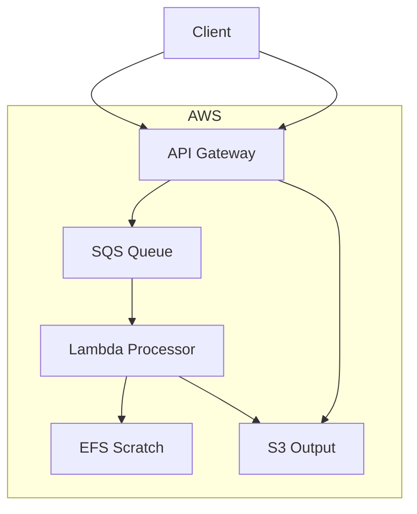
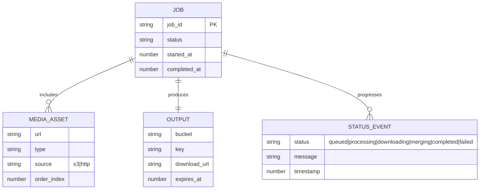

# Video editing service API (AWS Lambda + EFS)

A serverless video processing API that accepts videos and performs edits like merging, remuxing, or frame-by-frame modifications using FFmpeg.

## Architecture

- **API Gateway (HTTP API)**: Public endpoints `/`, `/process`, `/status/{job_id}`
- **Lambda (Processor)**: Python 3.11 with FFmpeg layer, runs inside VPC
- **SQS (Jobs Queue)**: Asynchronous job dispatch, Lambda consumes messages
- **S3 buckets**: Input and output buckets; job status JSON stored under `output-bucket/jobs/<job_id>/status.json`
- **EFS + Access Point**: Shared scratch storage for FFmpeg normalization and merge
- **VPC Endpoints**: S3 Gateway endpoint (for S3 access) and SQS Interface endpoint (for queue access)



## Deploy (Terraform)

## ER Diagram



### Prerequisites

1) **AWS Credentials**: Configure shared profile (recommended):
   ```bash
   # Create ~/.aws/credentials
   [default]
   aws_access_key_id = YOUR_ACCESS_KEY
   aws_secret_access_key = YOUR_SECRET_KEY
   
   # Create ~/.aws/config  
   [default]
   region = eu-north-1
   output = json
   ```

2) **FFmpeg Layer**: Choose one option:
   - **Option A (Recommended)**: Use AWS Serverless Application Repository layer
   - **Option B**: Build custom layer with static FFmpeg binary

### Project Structure

```
video-processing-api/
 ├─ main.tf              # Infrastructure resources
 ├─ variables.tf         # Configuration variables
 ├─ outputs.tf          # Stack outputs
 ├─ lambda/
 │   ├─ main.py         # Lambda handler
 │   └─ requirements.txt # Python dependencies
 └─ layers/
     └─ README.md       # Layer setup instructions
```

### Deployment Steps

1) **Initialize Terraform**:
   ```bash
   cd video-processing-api
   terraform init
   ```

2) **Deploy with External FFmpeg Layer** (Recommended):
   ```bash
   # Deploy SAR FFmpeg layer first (via AWS Console or CLI)
   # Then reference the layer ARN:
   terraform apply -auto-approve \
     -var="aws_region=eu-north-1" \
     -var="external_ffmpeg_layer_arn=arn:aws:lambda:eu-north-1:ACCOUNT:layer:ffmpeg:VERSION"
   ```

3) **Alternative: Deploy with Custom Layer**:
   ```bash
   # Place ffmpeg binary at layers/bin/ffmpeg, then:
   cd layers && zip -r ffmpeg-layer.zip bin/ && cd ..
   terraform apply -auto-approve \
     -var="aws_region=eu-north-1" \
     -var="ffmpeg_layer_zip_path=./layers/ffmpeg-layer.zip"
   ```

4) **Deploy without FFmpeg** (S3 copy only):
   ```bash
   terraform apply -auto-approve -var="aws_region=eu-north-1"
   ```

### API Usage

**Health Check**:
```bash
curl -s $(terraform output -raw api_endpoint)
# Expected: {"status":"ok","has_ffmpeg":true,"mount_path_exists":true}
```

**Video Merging** (Primary Use Case):
```bash
# Merge videos from URLs (async)
curl -s -X POST $(terraform output -raw api_endpoint)/process \
  -H 'content-type: application/json' \
  -d '{
    "operation": "merge",
    "video_urls": [
      "https://example.com/video1.mp4",
      "https://example.com/video2.mp4",
      "https://example.com/video3.mp4"
    ]
  }'

# Response (202 Accepted):
# {
#   "accepted": true,
#   "job_id": "a1b2c3d4",
#   "status_url": "https://<api>/status/a1b2c3d4"
# }
```

**Job Status Checking**:
```bash
# Check job progress (for frontend polling)
curl -s $(terraform output -raw api_endpoint)/status/a1b2c3d4

# Example response while running:
# {
#   "job_id": "a1b2c3d4",
#   "status": "merging",
#   "progress": 72.5,
#   "timestamp": "1695123456",
#   "metadata": {
#     "video_urls": ["..."],
#     "videos_count": 2,
#     "normalized": 1
#   }
# }

# When completed, includes a presigned download_url (valid ~1h):
# {
#   "job_id": "a1b2c3d4",
#   "status": "completed",
#   "progress": 100,
#   "metadata": {
#     "download_url": "https://s3.../merged/a1b2c3d4/output.mp4?..."
#   }
# }
```

### Examples

Clone this repo, then use the helper scripts under `examples/`.

- `examples/send_merge_request.sh`
  - Sends a merge request with provided URLs and prints `job_id` and `status_url`.
  - Usage:
    ```bash
    ./examples/send_merge_request.sh "https://example.com/video1.mp4" "https://example.com/video2.mp4"
    ```

- `examples/poll_status.sh`
  - Polls job status until it completes or fails.
  - Usage:
    ```bash
    ./examples/poll_status.sh <job_id>
    ```

- `examples/download_result.sh`
  - Fetches the presigned `download_url` from status and downloads the merged file.
  - Usage:
    ```bash
    ./examples/download_result.sh <job_id> [output_file]
    ```

**Single Video Processing** (Legacy):
```bash
# Process single video (remux/copy)
curl -X POST $(terraform output -raw api_endpoint)/process \
  -H 'content-type: application/json' \
  -d '{
    "operation": "remux",
    "input_bucket": "'$(terraform output -raw s3_input_bucket)'",
    "input_key": "video.mp4",
    "output_bucket": "'$(terraform output -raw s3_output_bucket)'",
    "output_key": "processed/output.mp4"
  }'
```

### API Endpoints

| Method | Path | Description |
|--------|------|-------------|
| `GET` | `/` | Health check and API documentation |
| `POST` | `/process` | Merge videos or process single video |
| `GET` | `/status/{job_id}` | Check job status for frontend polling |

### Request Examples

**Merge Multiple Videos**:
```json
{
  "operation": "merge",
  "video_urls": [
    "https://example.com/video1.mp4",
    "https://example.com/video2.mp4"
  ]
}
```

**Response**:
```json
{
  "success": true,
  "job_id": "a1b2c3d4",
  "videos_merged": 2,
  "download_url": "https://s3.amazonaws.com/.../merged-video.mp4?signature=...",
  "expires_in": "1 hour"
}
```

**Job Status Response**:
```json
{
  "job_id": "a1b2c3d4",
  "status": "completed",
  "timestamp": "1695123456",
  "metadata": {
    "video_urls": ["https://example.com/video1.mp4", "https://example.com/video2.mp4"],
    "videos_count": 2,
    "download_url": "https://s3.amazonaws.com/.../merged-video.mp4",
    "completed_at": 1695123500
  }
}
```

### Video Processing Features

- **Smart Normalization**: Videos are normalized to 1080p, 30fps, H.264/AAC for seamless merging
- **Aspect Ratio Preservation**: Automatic padding maintains original video proportions
- **Quality Control**: Uses CRF 23 for optimal quality/size balance
- **Fast Processing**: Two-pass approach ensures compatibility without quality loss
- **Secure Downloads**: Presigned URLs with 1-hour expiration
- **Job Tracking**: Real-time status updates for frontend integration

### Technical Notes

- **Processing**: Two-pass normalization ensures smooth video playback without freezing
- **Networking**: Lambda runs in private subnets with S3 Gateway endpoint for efficient access
- **Storage**: EFS provides shared temp storage mounted at `/mnt/efs` for video processing
- **Security**: IAM roles follow least-privilege with specific S3 and EFS permissions
- **Scalability**: Serverless architecture scales automatically with demand
