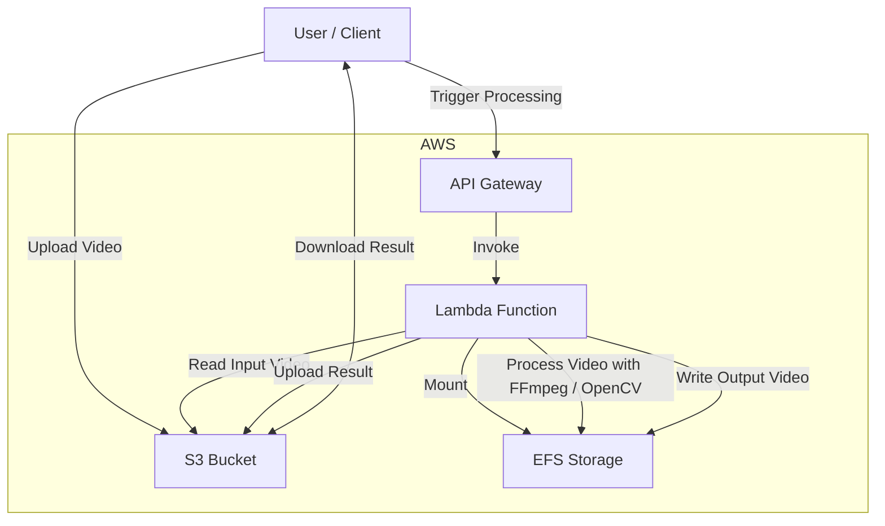

# Video editing service API (AWS Lambda + EFS)

A serverless video processing API that accepts videos and performs edits like merging, remuxing, or frame-by-frame modifications using FFmpeg.

## Architecture

- **VPC**: Private subnets with S3 Gateway endpoint
- **S3 buckets**: Input and output video storage
- **EFS + access point**: Lambda temp storage for video processing
- **Lambda function**: Python 3.11 with FFmpeg layer attached
- **API Gateway HTTP API**: RESTful endpoints to trigger processing



## Deploy (Terraform)

### Prerequisites

1) **AWS Credentials**: Configure shared profile (recommended):
   ```bash
   # Create ~/.aws/credentials
   [default]
   aws_access_key_id = YOUR_ACCESS_KEY
   aws_secret_access_key = YOUR_SECRET_KEY
   
   # Create ~/.aws/config  
   [default]
   region = eu-north-1
   output = json
   ```

2) **FFmpeg Layer**: Choose one option:
   - **Option A (Recommended)**: Use AWS Serverless Application Repository layer
   - **Option B**: Build custom layer with static FFmpeg binary

### Project Structure

```
video-processing-api/
 ├─ main.tf              # Infrastructure resources
 ├─ variables.tf         # Configuration variables
 ├─ outputs.tf          # Stack outputs
 ├─ lambda/
 │   ├─ main.py         # Lambda handler
 │   └─ requirements.txt # Python dependencies
 └─ layers/
     └─ README.md       # Layer setup instructions
```

### Deployment Steps

1) **Initialize Terraform**:
   ```bash
   cd video-processing-api
   terraform init
   ```

2) **Deploy with External FFmpeg Layer** (Recommended):
   ```bash
   # Deploy SAR FFmpeg layer first (via AWS Console or CLI)
   # Then reference the layer ARN:
   terraform apply -auto-approve \
     -var="aws_region=eu-north-1" \
     -var="external_ffmpeg_layer_arn=arn:aws:lambda:eu-north-1:ACCOUNT:layer:ffmpeg:VERSION"
   ```

3) **Alternative: Deploy with Custom Layer**:
   ```bash
   # Place ffmpeg binary at layers/bin/ffmpeg, then:
   cd layers && zip -r ffmpeg-layer.zip bin/ && cd ..
   terraform apply -auto-approve \
     -var="aws_region=eu-north-1" \
     -var="ffmpeg_layer_zip_path=./layers/ffmpeg-layer.zip"
   ```

4) **Deploy without FFmpeg** (S3 copy only):
   ```bash
   terraform apply -auto-approve -var="aws_region=eu-north-1"
   ```

### Testing

**Health Check**:
```bash
curl -s $(terraform output -raw api_endpoint)
# Expected: {"status":"ok","has_ffmpeg":true,"mount_path_exists":true}
```

**Video Processing**:
```bash
# Upload test video
aws s3 cp video.mp4 s3://$(terraform output -raw s3_input_bucket)/test/input.mp4

# Process video (FFmpeg remux)
curl -X POST $(terraform output -raw api_endpoint)/process \
  -H 'content-type: application/json' \
  -d '{
    "input_bucket": "'$(terraform output -raw s3_input_bucket)'",
    "input_key": "test/input.mp4",
    "output_bucket": "'$(terraform output -raw s3_output_bucket)'",
    "output_key": "processed/output.mp4"
  }'

# Download result
aws s3 cp s3://$(terraform output -raw s3_output_bucket)/processed/output.mp4 ./result.mp4
```

### Current Deployment

- **Region**: eu-north-1
- **API Endpoint**: https://ehe5e2scsh.execute-api.eu-north-1.amazonaws.com
- **Input Bucket**: video-processing-api-input-dev-920631856317-eu-north-1
- **Output Bucket**: video-processing-api-output-dev-920631856317-eu-north-1
- **FFmpeg Layer**: arn:aws:lambda:eu-north-1:920631856317:layer:ffmpeg:1

### Notes

- **Processing**: With FFmpeg layer, performs container remux (`-c copy`) using EFS scratch space. Falls back to S3 copy if FFmpeg fails.
- **Networking**: Lambda runs in private subnets with S3 Gateway endpoint for efficient S3 access.
- **Storage**: EFS provides shared temp storage mounted at `/mnt/efs` for video processing.
- **Security**: IAM roles follow least-privilege with specific S3 and EFS permissions.
